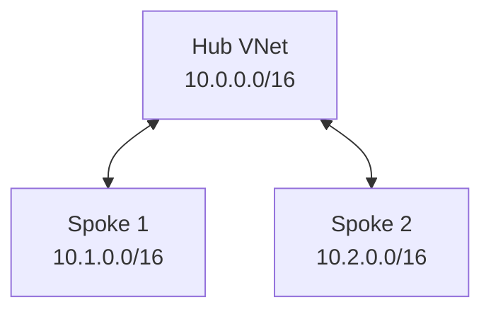

# Azure Hub-Spoke Terraform Lab


## Overview

This project implements a hub-and-spoke virtual network architecture in Microsoft Azure using Terraform and Azure CLI. The design uses a centralized hub VNet with two isolated spoke VNets, VNet peering, workload subnets, and NSGs to model a common enterprise cloud networking pattern.

The project is intended to build hands-on experience with Azure networking, infrastructure as code, remote Terraform state, and multi-machine workflows while applying routing and segmentation concepts developed through Network+ and CCNA study.

## Architecture

I created three separate VNets. The hub VNet uses the `10.0.0.0/16` address space and contains a `10.0.1.0/24` subnet for hub services. Spoke 1 uses `10.1.0.0/16` with a `10.1.1.0/24` workload subnet. Spoke 2 uses `10.2.0.0/16` with a `10.2.1.0/24` workload subnet. I configured VNet peering between the hub and each spoke in both directions.



I created NSGs and associated them with each spoke workload subnet. At this point they use Azure’s default NSG rules. Spoke-to-spoke transit is not currently available because Azure VNet peering is non-transitive; later in the project I plan to control this traffic more deliberately with NSG rules and routing.

>**Note:** VNet peering is non-transitive. Spoke 1 cannot automatically route through the hub to Spoke 2.

## Addressing Plan

| Network | Address Space | Subnet | Subnet CIDR |
| --- | --- | --- | --- |
| Hub | `10.0.0.0/16` | Hub Services | `10.0.1.0/24` |
| Spoke 1 | `10.1.0.0/16` | Workload | `10.1.1.0/24` |
| Spoke 2 | `10.2.0.0/16` | Workload | `10.2.1.0/24` |

## Terraform Resources Created

- [x] Resource group
- [x] Hub VNet
- [x] Hub services subnet
- [x] Spoke 1 VNet
- [x] Spoke 1 workload subnet
- [x] Spoke 2 VNet
- [x] Spoke 2 workload subnet
- [x] Hub-to-spoke VNet peering
- [x] Network Security Groups
- [x] NSG/subnet associations
- [x] Linux test VMs
- [ ] User-defined routes
- [ ] Network virtual appliance

## Remote State

I did much of the work on two different machines. This presented an issue with repository and local state. Local state is good for small projects/experiments such as this, but I wanted experience with Git CI/CD actions and the opportunity to store the Terraform state file remotely. The state file is Terraform's brain or memory, keeping track of your infrastructure. It allows Terraform to know what to create, update, or delete based on your declared infrastructure configuration. When you run Terraform commands such as `terraform plan` or `terraform apply`, **terraform** references the state file to determine what is already created, what needs to be destroyed or changed by keeping track of resources created, resource IDs and metadata, relationships and dependencies between resources, and outputs of resources.

Local state works well for small experiments, but it becomes awkward when moving between machines or collaborating with other people because the authoritative state file exists on one filesystem. A remote backend gives each authorized machine access to the same state and supports state locking during Terraform operations.

In this project I created a separate Azure resource group, storage account, and tfstate blob container using Azure CLI. I then configured the Terraform azurerm backend and migrated the original local state into Azure Storage.

## Multi-Machine Workflow

#### Machine A

```bash
git pull
terraform init
terraform plan
terraform apply
git add .
git commit -m "Describe changes"
git push
```

#### Machine B

```bash
git pull
terraform init
terraform plan
terraform apply
```

Github carries the code in a repository, keeping track of any changes to the code. Azure storage carries the state file allowing terraform to reference state from either machine.

## Security

### Implemented

- NSGs associated with workload subnets
- Terraform state stored outside the workload resource group
- Azure Storage public blob access disabled
- Minimum TLS version: `TLS 1.2`
- Microsoft Entra ID / RBAC authentication for Terraform state
- `Storage Blob Data Contributor` assigned for state access
- Terraform state excluded from Git
- `terraform.tfvars` excluded from Git
- SSH private keys excluded from Git

### Planned

- Storage account network restrictions
- Additional NSG rules
- Centralized traffic inspection
- Route control between spokes

## Virtual Machine Configuration

### Configuration

- Ubuntu 22.04 LTS Generation 2 Linux (0001-com-ubuntu-server-jammy, 22_04-lts-gen2)
- x64 architecture
- Standard_D2alds_v7
- SSH key authentication
- Dynamic private IP assignment
- No public IP on spoke VMs
- Jumpbox access method

### Cost Management

A stopped Azure virtual machine keeps its physical hardware reserved and continues billing for compute costs. On the other hand, deallocating a virtual machine releases the hardware and stops compute billing entirely. For cost management I am deallocating each VM when not testing/in-use.

### Next Steps

- SSH to jumpbox
- Test hub-to-spoke connectivity
- Test spoke-to-spoke behavior
- Add custom NSG rules
- Add UDRs / NVA later

## Issues and Lessons Learned

### Architecture Issues

Upon initiating this project, I understood that hub-and-spoke networks were common enterprise solutions but I did not understand why that architecture is sometimes optimal over others. I imagine that sort of expertise comes with several years of experience making decisions such as that. This project helped me understand how to implement a hub-and-spoke network. However, following an established architecture is different from independently selecting that architecture. I can now explain how the VNets, subnets, peering connections, and security controls fit together, but I am continuing to develop my understanding of when hub-and-spoke is preferable to simpler alternatives and what tradeoffs justify its added complexity.

Takeaway: by placing the shared-services subnet in the hub VNet, I observed non-transitory vnet peering. The spoke VNets can reach shared resources through the hub. Centralizing shared services reduces duplication and creates a common point for security and routing controls.

### Terraform State Across Multiple Machines

One of the biggest takeaways from this project was the function of the tfstate file. I wrote about that extensivly above. If I'm honest, in my first terraform/azure project, I didn't notice the function of the state file. I operated that instance locally so I didn't notice, or even pay attention to, the state file--that project was mostly a first diving into Terraform. In this project, with the need of moving from one machine to another, I was forced to pay attention to it. So I dove in. I read profesional writing. I paid attention behavior. I moved from local to remote. I'm certain I still have plenty, if not all, to learn, but, I learned a lot in just changing the location of the tfstate file. This was a big win in my mind here.

Takeaway: Git synchronizes the configuration, but it does not synchronize Terraform state.

### Azure Storage RBAC

**Note** Hit a 403 error during backend migration and the distinticion between being able to manage the storage account versus having blob data-plan permissions.

### Portable SSH Key Paths

The original VM configuration referenced a hard-coded public key path from one WSL machine instance. WHen I moved the project to the second system with the use of remote state, Terraform failed because that path did not exist. I replaced the absolute path with `pathexpand("~/.ssh/id_ed25519.pub")`, allowing each machine to resolve the key from its own home directory.

Takeway: Infrastructure code should avoid machine-specific paths when the project is intended to be portable.

### VM SKU and Architecture Compatibility

Test Linux VMs were added to each spoke to validate routing, security, and connectivity behavior. A separate jumpbox VM was deployed in the hub to provide a centralized management point without exposing the spoke workloads directly.

| VM | VNet | Subnet | Private IP | Role |
 | --- | --- | --- | --- | --- |
| `vm-spoke1` | `vnet-spoke1` | `snet-spoke1-workload` | `10.1.1.4` | Workload/test VM |
| `vm-spoke2` | `vnet-spoke2` | `snet-spoke2-workload` | `10.2.1.4` | Workload/test VM |
| `jumpbox-vm` | `vnet-hub` | `snet-hub-services` | `10.0.1.4` | Management/jump host |

### Physical Machine-Specific SSH Keys and Terraform Portability

Prior to creating the VMs, using pathexpand("~/.ssh/id_ed25519.pub") solved the SSH key path problem and made the project more portable across machines. However, each machine still used its own SSH public key.

I created the VMs on my home machine, then later continued the project from my laptop. After pulling the project and initializing Terraform, terraform plan showed that all of the VMs would need to be replaced. Terraform detected that the SSH public key in the configuration was different from the key that had originally been used to create the VMs, and changing the admin_ssh_key forces VM replacement.

I solved this by defining the VM SSH public key as a Terraform variable and storing the consistent key value in terraform.tfvars. This allowed both machines to evaluate the same VM configuration and eliminated the unnecessary destroy/recreate plan.

**Takeaway:** Making a file path portable is not enough if the underlying value is still machine-specific.

## Virtual Machine Deployment Issues

### Deployment Issues
This is where the messy stuff belongs: 

#### Original B-series SKU unavailable

Arm64 VM vs x64 image mismatch
Bpsv2 quota = 0
x64 B-series existed but was NotAvailableForSubscription
Queried D-series SKUs
Selected a D-series family with quota and x64 support
Successfully deployed both spoke VMs and jumpbox