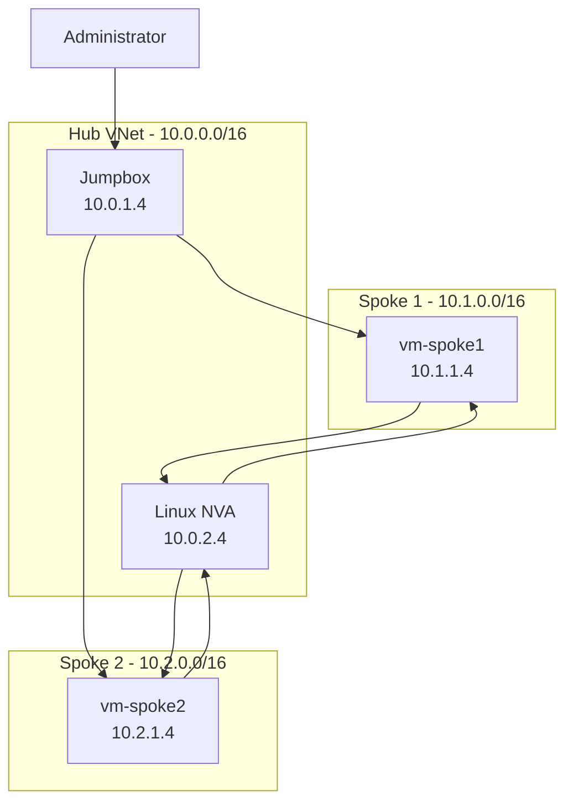

# Azure Hub-Spoke Terraform Lab


## Overview

This project implements a hub-and-spoke network architecture in Microsoft Azure using Terraform and Azure CLI.

The environment consists of a centralized hub VNet and two separate spoke VNets. The hub provides shared management and routing services, including a jumpbox and Linux network virtual appliance (NVA). The spoke VNets contain private Linux workload VMs and use user-defined routes (UDRs) to send inter-spoke traffic through the NVA.

I built this lab to gain hands-on experience with Azure networking and infrastructure as code while applying networking concepts from my Network+ and CCNA studies. The project evolved from basic VNet peering into a routed hub-and-spoke environment with remote Terraform state, custom NSG rules, private administrative access through a jumpbox, and routed spoke-to-spoke transit through an NVA.

## Architecture

The environment contains three separate Azure VNets:

- **Hub VNet:** `10.0.0.0/16`
  - Hub services subnet: `10.0.1.0/24`
  - NVA subnet: `10.0.2.0/24`
- **Spoke 1 VNet:** `10.1.0.0/16`
  - Workload subnet: `10.1.1.0/24`
- **Spoke 2 VNet:** `10.2.0.0/16`
  - Workload subnet: `10.2.1.0/24`

The hub contains a jumpbox used for administrative access and a Linux NVA used for inter-spoke routing. Each spoke contains a private Linux VM with no public IP address.

The hub is peered bidirectionally with each spoke. Because Azure VNet peering is non-transitive, Spoke 1 and Spoke 2 cannot communicate through the hub using peering alone.

To enable controlled spoke-to-spoke communication, each workload subnet has a user-defined route for the opposite spoke's address space. The routes use the NVA at `10.0.2.4` as the next-hop virtual appliance.



## Addressing Plan

| Network | Address Space | Subnet | Subnet CIDR | Host |
|---|---|---|---|---|
| `Hub` | `10.0.0.0/16` | `Hub Services` | `10.0.1.0/24` | `Jumpbox` `10.0.1.4` |
| `Hub` | `10.0.0.0/16` | `NVA` | `10.0.2.0/24` | `NVA` `10.0.2.4` |
| `Spoke 1` | `10.1.0.0/16` | `Workload` | `10.1.1.0/24` | `vm-spoke1` `10.1.1.4` |
| `Spoke 2` | `10.2.0.0/16` | `Workload` | `10.2.1.0/24` | `vm-spoke2` `10.2.1.4` |

## Infrastructure Deployed

Terraform provisions:

- Azure resource group
- Hub and spoke virtual networks
- Hub services, NVA, and spoke workload subnets
- Bidirectional hub-to-spoke VNet peerings
- Network Security Groups and subnet associations
- Linux jumpbox
- Two private spoke workload VMs
- Linux network virtual appliance
- User-defined route tables
- Route table/subnet associations
- Public IP for controlled jumpbox access

## Remote State

I divided the work between two different physical machines. This presented an issue with repository and local state. Local state is good for small projects/experiments such as this, but it becomes awkward when moving between machines. The state file is Terraform's brain or memory, keeping track of your infrastructure. It allows Terraform to know what to create, update, or delete based on your declared infrastructure configuration. When you run Terraform commands such as `terraform plan` or `terraform apply`, **terraform** references the state file to determine what is already created, what needs to be destroyed or changed by keeping track of resources created, resource IDs and metadata, relationships and dependencies between resources, and outputs of resources.

In this project I created a separate Azure resource group, storage account, and tfstate blob container using Azure CLI. I then configured the Terraform azurerm backend and migrated the original local state into Azure Storage.

## Multi-Machine Workflow

#### Machine A

```bash
git pull
terraform init
terraform plan
terraform apply
git add .
git commit -m "Describe changes"
git push
```

#### Machine B

```bash
git pull
terraform init
terraform plan
terraform apply
```

GitHub carries the code in a repository, keeping track of any changes to the code. Azure storage carries the state file allowing terraform to reference state from either machine. It's worth mentioning that terraform.tfvars is excluded from the initial git push because it's included in the .gitignore, therefore a git pull cannot place it on another machine. I created a matching .tfvars file on the opposing machine. 

## Implemented Controls

- NSGs associated with workload subnets
- Terraform state stored outside the workload resource group
- Azure Storage public blob access disabled
- Minimum TLS version: `TLS 1.2`
- Microsoft Entra ID / RBAC authentication for Terraform state
- `Storage Blob Data Contributor` assigned for state access
- Terraform state excluded from Git
- `terraform.tfvars` excluded from Git
- SSH private keys excluded from Git
- NSG restricts jumpbox SSH to the admin CIDR.

Added explicit inbound NSG rules on both spoke workload subnets to allow SSH from the hub services subnet (10.0.1.0/24) on TCP/22. Verified SSH connectivity to both spoke VMs through the hub jumpbox after applying the changes.

## Virtual Machine Configuration

- Ubuntu 22.04 LTS Generation 2 Linux (0001-com-ubuntu-server-jammy, 22_04-lts-gen2)
- x64 architecture
- Standard_D2alds_v7
- SSH key authentication
- Dynamic private IP assignment, statically assigned IP for the NVA
- No public IP on spoke VMs

### VM Inventory

Test Linux VMs were added to each spoke to validate routing, security, and connectivity behavior. A separate jumpbox VM was deployed in the hub to provide a centralized management point without exposing the spoke workloads directly.

| VM | VNet | Subnet | Private IP | Role |
 | --- | --- | --- | --- | --- |
| `vm-spoke1` | `vnet-spoke1` | `snet-spoke1-workload` | `10.1.1.4` | `Workload/test VM` |
| `vm-spoke2` | `vnet-spoke2` | `snet-spoke2-workload` | `10.2.1.4` | `Workload/test VM` |
| `jumpbox-vm` | `vnet-hub` | `snet-hub-services` | `10.0.1.4` | `Management/jump host` |
| `nva-vm` | `vnet-hub` | `snet-nva` | `10.0.2.4` | `NVA` |

### Cost Management

A stopped Azure virtual machine keeps its physical hardware reserved and continues billing for compute costs. On the other hand, deallocating a virtual machine releases the hardware and stops compute billing entirely. For cost management I am deallocating each VM when not testing/in-use.

### Access

The jumpbox has a public IP. SSH to the jumpbox is restricted to my admin CIDR. The spoke VMs remain private and I use SSH ProxyJump through the hub to reach them.

### Network Virtual Appliance

An NVA is a VM that forwards traffic between networks in place of a native Azure service. Commercial NVAs add firewall and inspection features. Mine is a plain Linux VM doing routing only. To act as a transit router, it needs IP forwarding enabled in two places:

On the Azure NIC:
  - Azure NIC: `ip_forwarding_enabled = true`

And, in the Linux OS:
  - Linux kernel: `net.ipv4.ip_forward = 1`

Both settings were required before the VM could function as a transit router between the spoke networks.

## Connectivity and Route Validation

Initial testing confirmed connectivity between the hub and each spoke in both directions. Direct communication between Spoke 1 and Spoke 2 failed as expected because Azure VNet peering is non-transitive.

After deploying the NVA and adding UDRs, spoke-to-spoke connectivity still failed even though both spoke VMs could reach the jumpbox and NVA. The peering configuration did not yet permit forwarded traffic.

Adding:

`allow_forwarded_traffic = true`

to the VNet peering configurations allowed transit traffic forwarded by the NVA to cross the peering connections successfully.

Final testing confirmed:

- Hub → Spoke 1: successful
- Hub → Spoke 2: successful
- Spoke 1 → Spoke 2 through NVA: successful
- Spoke 2 → Spoke 1 through NVA: successful

Effective route inspection showed the expected user-defined routes:

- Spoke 1: `10.2.0.0/16` → `VirtualAppliance` → `10.0.2.4`
- Spoke 2: `10.1.0.0/16` → `VirtualAppliance` → `10.0.2.4`

Packet capture using `tcpdump` on the NVA also confirmed ICMP traffic traversing the appliance in both directions.


*Figure 1 — Packet capture on the NVA showing ICMP traffic between spoke workloads.*

<table>
  <tr>
    <td>
      
      <br>
      <em>Spoke 1 → Spoke 2 via NVA</em>
    </td>
    <td>
      
      <br>
      <em>Spoke 2 → Spoke 1 via NVA</em>
    </td>
  </tr>
</table>

**Scope and Limits: the NVA forwards traffic only; filtering (iptables, Azure Firewall) is a possible next step from here.**

## Issues and Lessons Learned

### Terraform State Across Multiple Machines

One of the biggest takeaways from this project was the function of the tfstate file. I wrote about that extensively above. If I'm honest, in my first terraform/azure project, I didn't notice the function of the state file. I operated that instance locally so I didn't notice the state file or observe it's functionality. In this project, with the need of moving from one machine to another, I was forced to see it. I paid attention to it's behavior. I moved from local to remote. I'm certain I still have plenty, if not all, to learn, but, I learned a lot in just changing the location of the tfstate file. This was a big win in my mind here. Git synchronizes the configuration, but it does not synchronize Terraform state.

### Azure Storage RBAC

Hit a 403 during backend migration. I could manage the storage account (management plane) but had no blob data-plane permissions. Assigning Storage Blob Data Contributor fixed it.

### SSH Key Portability and Multi-Machine Access

`ssh` was the hero's journey in this lab.

The original VM configuration referenced a hard-coded public key path from one WSL instance. After moving the project to a second machine and using the remote Terraform state, the configuration failed because that path did not exist on the new system.

I first replaced the absolute path with:

`pathexpand("~/.ssh/id_ed25519.pub")`

This solved the path portability problem because each machine could resolve the key from its own home directory.

However, that exposed a second issue. Although the path was now portable, each machine still had a different SSH key pair. The VMs had originally been created using the public key from my home machine. When I continued the project from my laptop, `terraform plan` detected a different `admin_ssh_key` value and planned to replace all of the existing VMs.

I initially considered configuring multiple SSH public keys directly in the Terraform VM resources, but changing the existing `admin_ssh_key` configuration would still have required VM replacement.

Instead, I separated the Terraform provisioning key from ongoing administrator access.

The original VM provisioning public key was stored as a Terraform variable in `terraform.tfvars`, allowing both machines to evaluate the same VM configuration and preventing unnecessary destroy/recreate plans.

I then generated separate SSH key pairs for my work and personal machines. Their public keys were added to the existing VMs after deployment using `az vm user update`, while the corresponding private keys remained only on their respective machines.

With each workstation independently authorized, I configured SSH `ProxyJump` through the hub jumpbox to reach the private spoke VMs and NVA.

**Takeaway:** Making a file path portable does not make the underlying value portable. Terraform provisioning credentials and day-to-day administrator access can be managed separately: keeping the provisioning key stable preserved infrastructure state, while per-machine administrator keys allowed secure access without sharing private keys.

### Architectural Discovery

At the start of this project, I understood that hub-and-spoke networks were common enterprise solutions but I did not understand why that architecture is sometimes optimal over others. I imagine that sort of expertise comes with several years of experience making those decisions. This project helped me understand how to implement a hub-and-spoke network. Network segmentation is optimal in on-premises enterprise infrastructure. 

VLANs and separate subnets segment the network while ACLs, set on the router or firewall, filter out traffic. In hub-and-spoke architecture, the spokes are like VLANS, or segments. The NVA is like inter-VLAN routing. The jumpbox is the management segment. Having made this comparison, I'll add a quick caveat here: this lab built segmentation and inter-VLAN routing but not yet the ACL equivalency. A hub and spoke network, such as the one I developed here emulates a segmented on-premises network, abstracted through the cloud. When multiple teams or workloads share services (DNS, management access, logging, egress) it might be best to build those services in one place, rather than in every VNet. On the other hand, this can be more costly with more moving parts, latency for inter-spoke traffic, and potential bottlenecks. This configuration might be overkill if there's not a need for shared services, central inspection or there's only a single app in a VNet.

## Future Improvements and Next Steps

Because the hub NSG currently allows:

current-public-IP/32 -> TCP/22 -> jumpbox

moving between home and work networks changes my public IP and requires another Terraform apply to update admin_ip_cidr. That's a consequence of the security design, not a bug, but it doesn't scale to a real admin workflow.

A few areas I'd extend next:

**NVA filtering**. The NVA currently forwards traffic without inspecting it, and the default NSG rules let the spokes reach each other regardless. A next step would be adding stateful iptables rules on the NVA's FORWARD chain (the chain that handles transit traffic, as opposed to INPUT, which handles traffic addressed to the NVA itself) plus explicit NSG rules to restrict which ports the spokes can reach across the peering. This would turn the lab from a routing demo into an actual segmentation control.

**Admin access**. Azure Bastion or a VPN/private-access approach would remove the need for a public IP and a manually maintained IP allowlist on the jumpbox, which is closer to how I'd expect this to run in production.

**CI/CD**. A GitHub Actions workflow using OIDC federation to Azure, so no long-lived credentials are stored, running terraform fmt, validate, and plan on pull requests, with apply gated behind manual approval. 