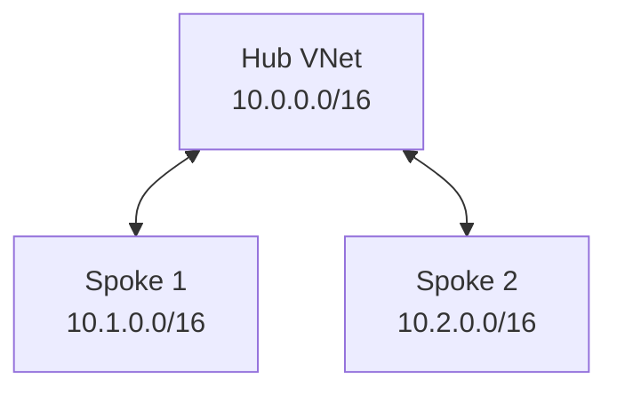

# Azure Hub-Spoke Terraform Lab


## Overview:

I wanted to build a hub-and-spoke virtual network architecture in Azure that mimics many major businesses today. Hub-and-spoke virtual networks provide centralized shared security and networking services while isolating individual workloads. In this project, I wanted to gain experience designing the architecture including vnets, subnets, NSGs, and connectivity. I used **Terraform** and **AzureCLI** to automate building the resources. The lab is meant to let me gain reps with automating the build process, as well to apply many of the networking concepts and skills I gained in studying for Network+ and CCNA. The lab is also meant to teach me much of the Azure architecture and how it works together to build a system to solve a business need.


## Architecture:

I created three separate VNets. The hub VNet uses the 10.0.0.0/16 address space and contains a `10.0.1.0/24` subnet for hub services. Spoke 1 uses `10.1.0.0/16` with a `10.1.1.0/24` workload subnet. Spoke 2 uses `10.2.0.0/16` with a `10.2.1.0/24` workload subnet. I configured VNet peering between the hub and each spoke in both directions. 



I created NSGs and associated them with each spoke workload subnet. At this point they use Azure’s default NSG rules. Spoke-to-spoke transit is not currently available because Azure VNet peering is non-transitive; later in the project I plan to control this traffic more deliberately with NSG rules and routing. 

>**Note:** VNet peering is non-transitive. Spoke 1 cannot automatically route through the hub to Spoke 2.

## Addressing Plan

| Network | Address Space | Subnet | Subnet CIDR |
|---|---|---|---|
| Hub | `10.0.0.0/16` | Hub Services | `10.0.1.0/24` |
| Spoke 1 | `10.1.0.0/16` | Workload | `10.1.1.0/24` |
| Spoke 2 | `10.2.0.0/16` | Workload | `10.2.1.0/24` |

## Terraform Resources Created

- [x] Resource group
- [x] Hub VNet
- [x] Hub services subnet
- [x] Spoke 1 VNet
- [x] Spoke 1 workload subnet
- [x] Spoke 2 VNet
- [x] Spoke 2 workload subnet
- [x] Hub-to-spoke VNet peering
- [x] Network Security Groups
- [x] NSG/subnet associations
- [ ] Linux test VMs
- [ ] User-defined routes
- [ ] Network virtual appliance

## Remote State: 

I did much of the work on two different machines. This presented an issue with repository and local state. Local state is good for small projects/experiments such as this, but I wanted experience with Git CI/CD actions and the opportunity to store the Terraform state file remotely. The state file is Terraform's brain or memory, keeping track of your infrastructure. It allows Terraform to know what to create, update, or delete based on your declared infrastructure configuration. When you run Terraform commands such as `terraform plan` or `terraform apply`, **terraform** references the state file to determine what is already created, what needs to be destroyed or changed by keeping track of resources created, resource IDs and metadata, relationships and dependencies between resources, and outputs of resources. 

Local state works well for small experiments, but it becomes awkward when moving between machines or collaborating with other people because the authoritative state file exists on one filesystem. A remote backend gives each authorized machine access to the same state and supports state locking during Terraform operations.

In this project I created a separate Azure resource group, storage account, and tfstate blob container using Azure CLI. I then configured the Terraform azurerm backend and migrated the original local state into Azure Storage.

   ### Multi-Machine Workflow

**Machine A**

```bash
git pull
terraform init
terraform plan
terraform apply
git add .
git commit -m "Describe changes"
git push
```

**Machine B**

```bash
git pull
terraform init
terraform plan
terraform apply
```

Github carries the code in a repository, keeping track of any changes to the code. Azure storage carries the state file allowing terraform to reference state from either machine. 

## Security

### Implemented

- NSGs associated with workload subnets
- Terraform state stored outside the workload resource group
- Azure Storage public blob access disabled
- Minimum TLS version: `TLS 1.2`
- Microsoft Entra ID / RBAC authentication for Terraform state
- `Storage Blob Data Contributor` assigned for state access
- Terraform state excluded from Git
- `terraform.tfvars` excluded from Git
- SSH private keys excluded from Git

### Planned

- Storage account network restrictions
- Additional NSG rules
- Centralized traffic inspection
- Route control between spokes

> **Current limitation:** Test VM deployment is temporarily blocked while
> evaluating VM SKU, CPU architecture, and regional quota availability.


## Issues and Lessons Learned

### Terraform State Across Multiple Machines

...

### Azure Storage RBAC

...

### Portable SSH Key Paths

...

### VM SKU and Architecture Compatibility

...

### Azure vCPU Quotas

...