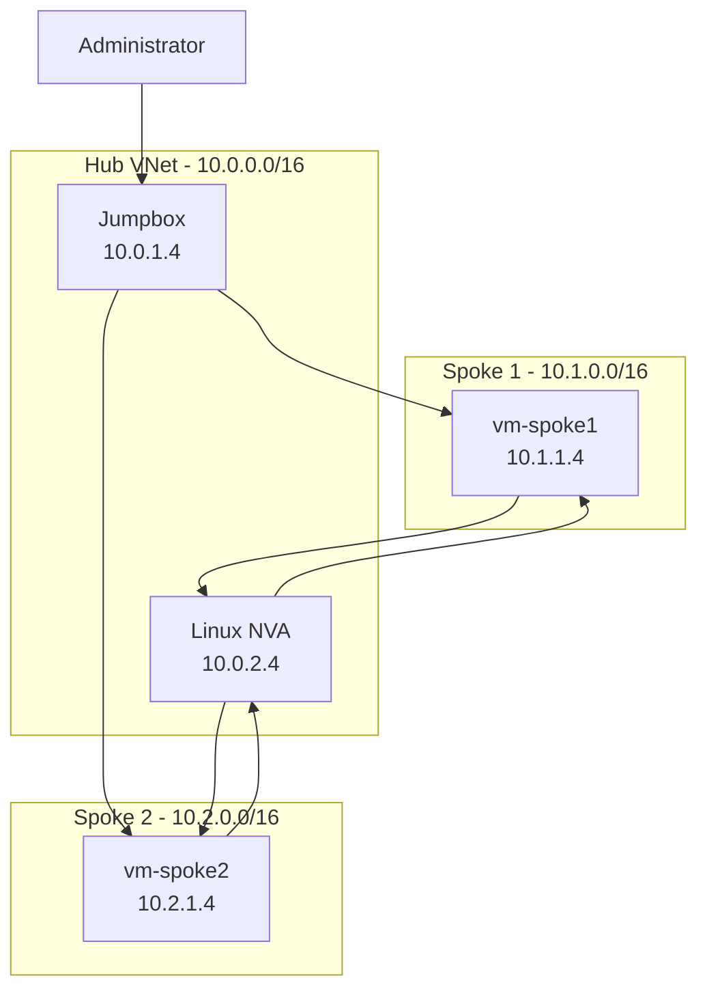
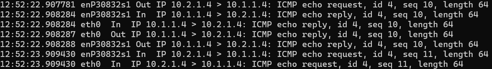
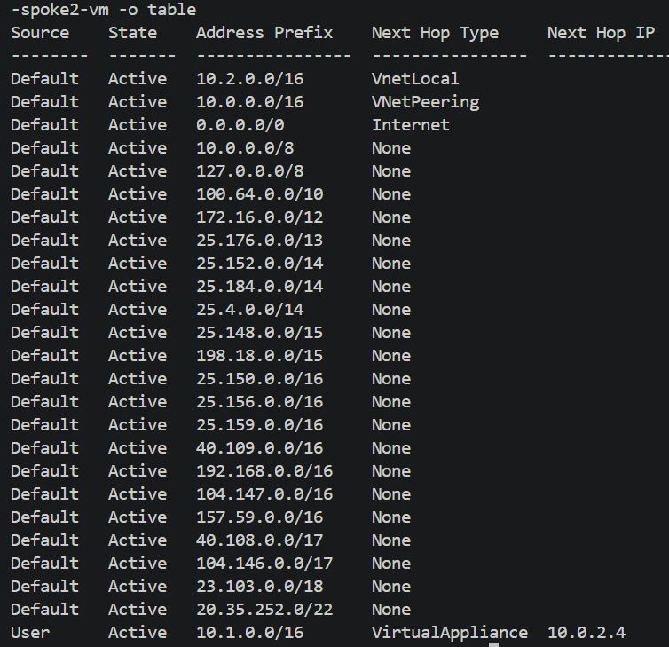

# Azure Hub-Spoke Terraform Lab


## Overview

This project implements a hub-and-spoke network architecture in Microsoft Azure using Terraform and Azure CLI.

The environment consists of a centralized hub VNet and two isolated spoke VNets. The hub provides shared management and routing services, including a jumpbox and Linux network virtual appliance (NVA). The spoke VNets contain private Linux workload VMs and use user-defined routes (UDRs) to send inter-spoke traffic through the NVA.

I built this lab to gain hands-on experience with Azure networking and infrastructure as code while applying networking concepts from my Network+ and CCNA studies. The project evolved from basic VNet peering into a routed hub-and-spoke environment with remote Terraform state, custom NSG rules, private administrative access through a jumpbox, and controlled spoke-to-spoke transit.

## Architecture

The environment contains three separate Azure VNets:

- **Hub VNet:** `10.0.0.0/16`
  - Hub services subnet: `10.0.1.0/24`
  - NVA subnet: `10.0.2.0/24`
- **Spoke 1 VNet:** `10.1.0.0/16`
  - Workload subnet: `10.1.1.0/24`
- **Spoke 2 VNet:** `10.2.0.0/16`
  - Workload subnet: `10.2.1.0/24`

The hub contains a jumpbox used for administrative access and a Linux NVA used for inter-spoke routing. Each spoke contains a private Linux VM with no public IP address.

The hub is peered bidirectionally with each spoke. Because Azure VNet peering is non-transitive, Spoke 1 and Spoke 2 cannot communicate through the hub using peering alone.

To enable controlled spoke-to-spoke communication, each workload subnet has a user-defined route for the opposite spoke's address space. The routes use the NVA at `10.0.2.4` as the next-hop virtual appliance.




## Addressing Plan

| Network | Address Space | Subnet | Subnet CIDR | Host |
|---|---|---|---|---|
| `Hub` | `10.0.0.0/16` | `Hub Services` | `10.0.1.0/24` | `Jumpbox` `10.0.1.4` |
| `Hub` | `10.0.0.0/16` | `NVA` | `10.0.2.0/24` | `NVA` `10.0.2.4` |
| `Spoke 1` | `10.1.0.0/16` | `Workload` | `10.1.1.0/24` | `vm-spoke1` `10.1.1.4` |
| `Spoke 2` | `10.2.0.0/16` | `Workload` | `10.2.1.0/24` | `vm-spoke2` `10.2.1.4` |

## Infrastructure Deployed

Terraform provisions:

- Azure resource group
- Hub and spoke virtual networks
- Hub services, NVA, and spoke workload subnets
- Bidirectional hub-to-spoke VNet peerings
- Network Security Groups and subnet associations
- Linux jumpbox
- Two private spoke workload VMs
- Linux network virtual appliance
- User-defined route tables
- Route table/subnet associations
- Public IP for controlled jumpbox access

## Remote State

I divided the work between two different physical machines. This presented an issue with repository and local state. Local state is good for small projects/experiments such as this, but I wanted experience working with the Terraform state file remotely. The state file is Terraform's brain or memory, keeping track of your infrastructure. It allows Terraform to know what to create, update, or delete based on your declared infrastructure configuration. When you run Terraform commands such as `terraform plan` or `terraform apply`, **terraform** references the state file to determine what is already created, what needs to be destroyed or changed by keeping track of resources created, resource IDs and metadata, relationships and dependencies between resources, and outputs of resources.

Local state works well for small experiments, but it becomes awkward when moving between machines or collaborating with other people because the authoritative state file exists on one filesystem. A remote backend gives each authorized machine access to the same state and supports state locking during Terraform operations.

In this project I created a separate Azure resource group, storage account, and tfstate blob container using Azure CLI. I then configured the Terraform azurerm backend and migrated the original local state into Azure Storage.

## Multi-Machine Workflow

#### Machine A

```bash
git pull
terraform init
terraform plan
terraform apply
git add .
git commit -m "Describe changes"
git push
```

#### Machine B

```bash
git pull
terraform init
terraform plan
terraform apply
```

Github carries the code in a repository, keeping track of any changes to the code. Azure storage carries the state file allowing terraform to reference state from either machine.

## Implemented Controls

- NSGs associated with workload subnets
- Terraform state stored outside the workload resource group
- Azure Storage public blob access disabled
- Minimum TLS version: `TLS 1.2`
- Microsoft Entra ID / RBAC authentication for Terraform state
- `Storage Blob Data Contributor` assigned for state access
- Terraform state excluded from Git
- `terraform.tfvars` excluded from Git
- SSH private keys excluded from Git

Added explicit inbound NSG rules on both spoke workload subnets to allow SSH from the hub services subnet (10.0.1.0/24) on TCP/22. Verified SSH connectivity to both spoke VMs through the hub jumpbox after applying the changes.

## Virtual Machine Configuration

- Ubuntu 22.04 LTS Generation 2 Linux (0001-com-ubuntu-server-jammy, 22_04-lts-gen2)
- x64 architecture
- Standard_D2alds_v7
- SSH key authentication
- Dynamic private IP assignment
- No public IP on spoke VMs
- Jumpbox access method

### VM SKU and Architecture Compatibility

Test Linux VMs were added to each spoke to validate routing, security, and connectivity behavior. A separate jumpbox VM was deployed in the hub to provide a centralized management point without exposing the spoke workloads directly.

| VM | VNet | Subnet | Private IP | Role |
 | --- | --- | --- | --- | --- |
| `vm-spoke1` | `vnet-spoke1` | `snet-spoke1-workload` | `10.1.1.4` | `Workload/test VM` |
| `vm-spoke2` | `vnet-spoke2` | `snet-spoke2-workload` | `10.2.1.4` | `Workload/test VM` |
| `jumpbox-vm` | `vnet-hub` | `snet-hub-services` | `10.0.1.4` | `Management/jump host` |
| `hub-nva` | `vnet-hub` | `snet-nva` | `10.0.2.4` | `NVA` |

### Cost Management

A stopped Azure virtual machine keeps its physical hardware reserved and continues billing for compute costs. On the other hand, deallocating a virtual machine releases the hardware and stops compute billing entirely. For cost management I am deallocating each VM when not testing/in-use.

### Access

The jumpbox has a public IP. SSH to the jumpbox is restricted to my admin CIDR. The spoke VMs remain private and you use SSH ProxyJump through the hub to reach them.

### Network Virtual Appliance

An Azure network virtual appliance (NVA) is a specialized virtual machine that controls, inspects, and optimizes network traffic routing between security zones or networks. They act as next generation firewalls (NGFW) that routes, forwards and filters inbound and outbound traffic at two levels: Azure config and in the Linux Kernal. A common deployment manually configuring into a custom Virtual Network using User Defined Routes (UDR). That is how this NVA was configured. I deployed an NVA with the same VM and linux configuration as the jumpbox, spoke1, and spoke2. A linux NVA needs IP forwarding enabled on the Azure NIC and in the OS configuration.

On the Azure NIC:
  - Azure NIC: `ip_forwarding_enabled = true`

And, in the Linux OS:
  - Linux kernel: `net.ipv4.ip_forward = 1`

Both settings were required before the VM could function as a transit router between the spoke networks.

## Connectivity and Route Validation

Initial testing confirmed connectivity between the hub and each spoke in both directions. Direct communication between Spoke 1 and Spoke 2 failed as expected because Azure VNet peering is non-transitive.

After deploying the NVA and adding UDRs, spoke-to-spoke connectivity still failed even though both spoke VMs could reach the jumpbox and NVA. The peering configuration did not yet permit forwarded traffic.

Adding:

`allow_forwarded_traffic = true`

to the VNet peering configurations allowed transit traffic forwarded by the NVA to cross the peering connections successfully.

Final testing confirmed:

- Hub → Spoke 1: successful
- Hub → Spoke 2: successful
- Spoke 1 → Spoke 2 through NVA: successful
- Spoke 2 → Spoke 1 through NVA: successful

Effective route inspection showed the expected user-defined routes:

- Spoke 1: `10.2.0.0/16` → `VirtualAppliance` → `10.0.2.4`
- Spoke 2: `10.1.0.0/16` → `VirtualAppliance` → `10.0.2.4`

Packet capture using `tcpdump` on the NVA also confirmed ICMP traffic traversing the appliance in both directions.



*Figure 1 — Packet capture on the NVA showing ICMP traffic between spoke workloads.*

Effective route inspection on both spoke VM NICs confirmed active user-defined routes for the opposite spoke address space, with VirtualAppliance as the next-hop type and 10.0.2.4 as the next-hop IP. Combined with packet captures on the NVA, this verified that spoke-to-spoke traffic was intentionally routed through the hub NVA. 

<table>
  <tr>
    <td>
      
      <br>
      <em>Spoke 1 → Spoke 2 via NVA</em>
    </td>
    <td>
      
      <br>
      <em>Spoke 2 → Spoke 1 via NVA</em>
    </td>
  </tr>
</table>

**Scope and Limits: the NVA forwards traffic only; filtering (iptables, Azure firewall) is a possible next step from here, however, this lab is complete as it stands.**

## Issues and Lessons Learned

### Architecture Issues

Upon initiating this project, I understood that hub-and-spoke networks were common enterprise solutions but I did not understand why that architecture is sometimes optimal over others. I imagine that sort of expertise comes with several years of experience making decisions such as that. This project helped me understand how to implement a hub-and-spoke network. However, following an established architecture is different from independently selecting that architecture. I can now explain how the VNets, subnets, peering connections, and security controls fit together, but I am continuing to develop my understanding of when hub-and-spoke is preferable to simpler alternatives and what tradeoffs justify its added complexity.

Takeaway: by placing the shared-services subnet in the hub VNet, I observed non-transitive vnet peering. The spoke VNets can reach shared resources through the hub. Centralizing shared services reduces duplication and creates a common point for security and routing controls.

### Terraform State Across Multiple Machines

One of the biggest takeaways from this project was the function of the tfstate file. I wrote about that extensively above. If I'm honest, in my first terraform/azure project, I didn't notice the function of the state file. I operated that instance locally so I didn't notice, or even pay attention to, the state file--that project was mostly a first diving into Terraform. In this project, with the need of moving from one machine to another, I was forced to pay attention to it. So I dove in. I read professional writing. I paid attention behavior. I moved from local to remote. I'm certain I still have plenty, if not all, to learn, but, I learned a lot in just changing the location of the tfstate file. This was a big win in my mind here.

Takeaway: Git synchronizes the configuration, but it does not synchronize Terraform state.

### Azure Storage RBAC

**Note** Hit a 403 error during backend migration and the distinction between being able to manage the storage account versus having blob data-plan permissions.

### Portable SSH Key Paths

The original VM configuration referenced a hard-coded public key path from one WSL machine instance. WHen I moved the project to the second system with the use of remote state, Terraform failed because that path did not exist. I replaced the absolute path with `pathexpand("~/.ssh/id_ed25519.pub")`, allowing each machine to resolve the key from its own home directory.

Takeaway: Infrastructure code should avoid machine-specific paths when the project is intended to be portable.

### Physical Machine-Specific SSH Keys and Terraform Portability

Prior to creating the VMs, using pathexpand("~/.ssh/id_ed25519.pub") solved the SSH key path problem and made the project more portable across machines. However, each machine still used its own SSH public key.

I created the VMs on my home machine, then later continued the project from my laptop. After pulling the project and initializing Terraform, terraform plan showed that all of the VMs would need to be replaced. Terraform detected that the SSH public key in the configuration was different from the key that had originally been used to create the VMs, and changing the admin_ssh_key forces VM replacement.

I solved this by defining the VM SSH public key as a Terraform variable and storing the consistent key value in terraform.tfvars. This allowed both machines to evaluate the same VM configuration and eliminated the unnecessary destroy/recreate plan.

**Takeaway:** Making a file path portable is not enough if the underlying value is still machine-specific.

### Virtual Machine Deployment Issues

Arm64 VM vs x64 image mismatch
Bpsv2 quota = 0
x64 B-series existed but was NotAvailableForSubscription
Queried D-series SKUs
Selected a D-series family with quota and x64 support
Successfully deployed both spoke VMs and jumpbox

### SSH Access Across Multiple Admin Machines

**EDIT**
Initially, I used one Terraform-managed SSH public key for the VMs.
I made the path portable with `pathexpand()`, but that only solved the file-path problem.
When I switched machines, each workstation had a different SSH key pair.
Changing Terraform's admin_ssh_key to match the second machine caused Terraform to plan replacement of all existing VMs because that property is immutable/force-new.
I first considered storing multiple admin public keys directly in the Terraform VM resource.
That would still require replacing the already-created VMs, so I backed out that change.
I kept the original provisioning public key in Terraform so the infrastructure remained stable.
I generated separate SSH key pairs for the work and personal machines.
I added each workstation's public key to the existing VMs after deployment using az vm user update.
The private keys remain only on their respective machines.
I then used the hub jumpbox and SSH ProxyJump to reach the private spoke VMs.

**Takeaway:** Terraform provisioning credentials and ongoing administrator access do not necessarily need to be managed the same way. Keeping the original provisioning key stable avoided unnecessary VM replacement, while adding separate administrator public keys allowed each workstation to authenticate independently without sharing private keys.

### Admin Access and Dynamic Public IPs

**EDIT**
Because the hub NSG currently allows:

`current-public-IP/32 -> TCP/22 -> jumpbox`

moving between home/work networks means admin_ip_cidr changes and requires another Terraform apply. That isn’t a mistake — it’s a consequence of the security design I chose. **Later discuss whether Bastion, VPN/private access, or another management approach is a better fit.**

### Testing traffic

SSH to jumpbox is successful from both of my physical machines after a tremendous amount of troubleshooting SSH handling.

Connectivity testing confirmed successful communication between the hub and each spoke in both directions. Direct communication between Spoke1 and Spoke2 failed as expected because Azure VNet peering is non-transitive.

Following deployment of the NVA and UDRs, connectivity tests between Spoke1 and Spoke2 still failed bidirectionally, although both spokes could successfully reach the jumpbox and NVA private IPs. Adding allow_forwarded_traffic = true to the VNet peering configurations allowed spoke-to-spoke traffic to traverse the hub NVA successfully. This demonstrated that configuring an NVA and UDRs alone is not sufficient; the peering relationships must also explicitly permit forwarded traffic.

Packet capture on the NVA using tcpdump confirmed ICMP traffic from both spokes traversed the NVA in both directions, validating that the UDRs and forwarded-traffic peering settings were directing spoke-to-spoke traffic through the hub as intended.
